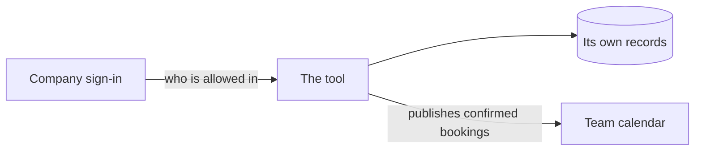

# Masterplan

Trued against: not yet checked

<!-- The saved code state last compared with this page. The agent follows
.agents/skills/setup-ai-build-kit/references/masterplan-changes.md; the person
never has to read a hash. -->

<!-- What the tool is now. Present tense. Keep the core readable in roughly
one to two pages. Optional sections appear only when they carry real decisions.
On every build path, key terms and decided lines may carry an optional one-line
"rests on" clause in plain words, naming the evidence behind the decision.
Follow the decision rules in
.agents/skills/setup-ai-build-kit/references/pieces.md. -->

## Build path

<!-- Rewritten only by re-running the fit check, which lives at
.agents/skills/setup-ai-build-kit/references/fit-check.md. The agent reads this section
first, every session. -->

Path:
Why:
Sensitive areas:
<!-- Build with care only. Under each area, add an indented `paths:` line and
at most one `boundary:` line. List every other top-level source folder on an
indented `none:` line. Update the map in the same save as a code move. Omit the
map on Explore privately and Build and run it. -->
Accepted:
Recheck when:
Last checked:

## What it does, and for whom

## Key terms

<!-- Optional. Add only when two ordinary words could be confused. One name per
thing. No implementation terms. -->

## Who can see and do what

## What it connects to

<!-- A picture of this tool and everything outside it that it reaches: where it
keeps its own data, and each outside service. Nothing internal: no screens, no
parts of the code. Draw it as a mermaid flowchart, which GitHub shows as a
picture, label every line with what flows and which way, and use the names the
team already uses. For example:

Read it back at founding, so the team confirms the tool should reach each of
those. Update it whenever a piece adds, removes, or changes one of them. -->

## What data it holds, and where it comes from

## How it is used, step by step

## What correct looks like

<!-- The rules that must always hold, and what a right answer looks like
against work the team knows. -->

## What happens when it fails

<!-- User-facing errors, manual fallback, recovery owner, and any consequence
that changes the build path. -->

## How it stays running

<!-- Optional for live tools. Services, alerts, backup, billing owner, access
owner, and manual fallback. Do not copy credentials here.

Where the tool runs on a server somebody else runs, /ship writes a hosting
request here on the first launch: repo and branch, lane, port, env var names,
persisted paths and health check path. Names only, never a value. What comes
back from the server goes under it. Later launches read it back. -->

## Out of scope

<!-- Said out loud, so nobody builds it by accident. -->
