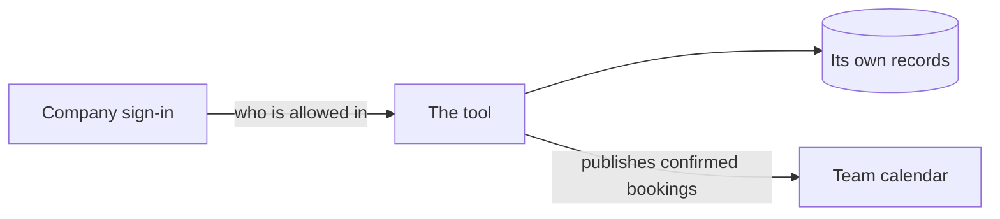

# Concept name

<!-- Use this template once per named concept, not as a catch-all copy of the old masterplan. Each rule has one authoritative home. Choose only the applicable prompts below; fill from the interview and remove empty sections and comments before saving. -->

## What it is

<!-- The concept and the user outcome it owns. -->

## How it works

### What it does, and for whom

### Key terms

<!-- Optional. Add only when two ordinary words could be confused. One name per
thing. No implementation terms. -->

## Rules

<!-- On every build path, key terms and decided lines may carry an optional one-line "rests on" clause in plain words, naming actual evidence. Follow the decision rules in the `setup-ai-build-kit` skill's `references/pieces.md`. -->

### Who can see and do what

### What it connects to

<!-- A picture of this tool and everything outside it that it reaches: where it
keeps its own data, and each outside service. Nothing internal: no screens, no
parts of the code. Draw it as a mermaid flowchart, which GitHub shows as a
picture, label every line with what flows and which way, and use the names the
team already uses. For example:

Read it back at founding, so the team confirms the tool should reach each of
those. Update it whenever a piece adds, removes, or changes one of them. -->

### What data it holds, and where it comes from

### How it is used, step by step

### What correct looks like

<!-- The rules that must always hold, and what a right answer looks like
against work the team knows. -->

### What happens when it fails

<!-- User-facing errors, manual fallback, recovery owner, and any consequence
that changes the build path. -->

### Out of scope

<!-- Decisions against a capability and unresolved future intent. Keep separate from what the current tool does. -->

## Where it lives

<!-- Owning implementation areas and links to related concepts, without copying their rules. -->
