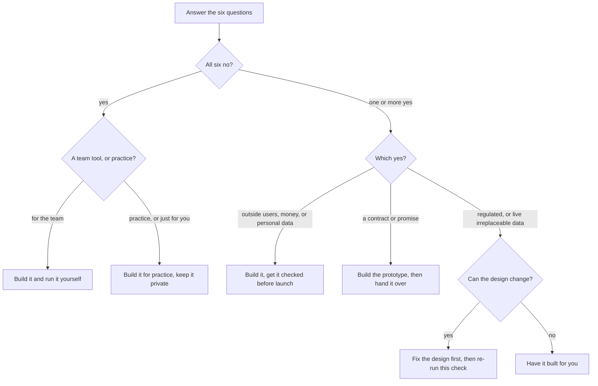

# The fit check

This pack is tuned for one kind of project: a tool for your own team,
holding your own data, with nobody outside relying on it. This check finds
out whether that's the project at hand, and what to do when it isn't. It
runs during start, and again whenever a request would change what kind of
project this is.

## Six questions

1. Will anyone outside the team sign in or rely on it?
2. Will real money move through it: payments, invoices it sends, anything
   that charges?
3. Does a contract or promise attach to it: uptime someone signed for, a
   client deliverable?
4. Will it hold data about people that would matter if it leaked: health,
   finances, anything personal beyond names and work emails?
5. Does it sit in a regulated area: medical, legal, financial advice,
   anything with a compliance officer?
6. Does it need to run on live data from day one, data the team could not
   afford to lose or corrupt?

## The six outcomes

**Build it and run it yourself.** All six answers are no, and the tool is
for the team. The pre-filled stakes section in templates/masterplan.md
applies as written. This is the project the pack was made for.

**Build it for practice, keep it private.** All six answers are no, and
it's a first prototype or a personal tool. Everything here works the same;
the one difference is that ship waits. The day it stops being practice,
this check runs again.

**Build it, get it checked before launch.** Yes to outside users, money,
or personal data. The tool still gets built here, with each yes written
into the stakes section as a flag. Before a flagged part goes live, a
professional gets paid for a few hours to review exactly that part; the
ship skill writes the brief. Launch happens one connection at a time,
flagged parts last.

**Build the prototype, then hand it over.** Yes to a contract or a
promise. Everything above still applies, and running the tool long-term
should be someone's paid job instead of a side duty. The handover gets
planned before launch; the ship skill assembles the package.

**Fix the design first.** Yes to regulation or live irreplaceable data,
and the design can change: start on a copy of the data instead of the live
source, or take the regulated part out of scope. Then this check runs
again, and the answer usually becomes no.

**Have it built for you.** Yes to regulation or live irreplaceable data,
and the design can't change. This is the honest limit of building it
without professionals. Nothing done here is wasted: the interview and the
masterplan are exactly the brief a professional needs, and directing them
well is what this pack teaches anyway.

## Write it down

Whatever the outcome, it goes in the stakes section: the answers, the
date, and the launch rule that follows. The agent reads that section first
in every session. This half page is how the whole system knows how careful
to be.
