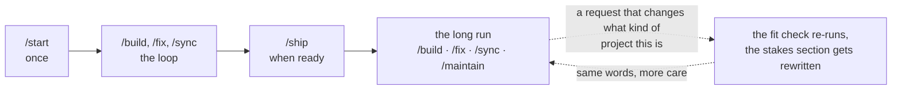

# ai-build-kit

A clonable kit of seven skills for building good software with an AI agent. Simple enough to need no coding knowledge, solid enough for technical people to extend.

## What this is

AI agents can write working software now. What they can't do is stop you from skipping the steps that make software trustworthy: agreeing what a thing should do before building it, proving it works before saving it, checking the risky parts before anyone relies on them, and keeping records so next month's you knows what this month's you did.

This kit is those steps, packaged as skills the agent follows and words you type. Seven commands cover a project's whole life. Four documents hold its memory, because the agent has none between sessions. A handful of standing rules keep it careful. You describe what you want in plain language and judge the results by using them; the kit handles everything in between.

No coding knowledge is needed. The workflow never asks you to read code: every check is something you click, type, or see.

## Quick start

1. Click **Use this template** above and name your new repository (make it private).
2. Open the repo in your agent tool. Any of these work out of the box: [Claude Code](https://claude.com/claude-code), [Cursor](https://cursor.com), [OpenAI Codex](https://developers.openai.com/codex), or [Gemini CLI](https://geminicli.com). Clone or open the repo the way that tool prefers, signing in to GitHub when prompted.
3. Copy `.env.example` to a file named `.env`. Keys will live there later; the file never leaves your machine.
4. Type `/start` and answer its questions. (In every supported tool the seven words are slash commands; if yours has none, just ask for "start" by name.)

That's day one. `/start` interviews you about the tool you want, checks the project fits this kit, writes the founding documents, and stands the project up with one passing test. The full setup recipe, including inviting teammates and which tool lights up what, is in [INIT.md](INIT.md) and [COMPATIBILITY.md](COMPATIBILITY.md).

## The seven words

Commands are named after moments, because that's how you'll reach for them.

| The moment | Type | What happens |
|---|---|---|
| I'm starting something | `/start` | Interviews you, runs the fit check, writes the masterplan and plan, stands the project up. Once per project, resumable. |
| Keep going, or: I want it to... | `/build` | Alone: builds the next piece from the plan. With words after it: takes any request in plain language and works out what kind of work it is. `/build auto` runs several pieces in a row. |
| It's broken | `/fix` | Evidence in, cause found before code changes, and a test that keeps the bug from coming back. |
| I think it's ready | `/ship` | Checks everything, then moves work to the copy your team actually uses. The only command that touches that copy. |
| I'm done for today | `/sync` | Trues the documents up against what actually happened. Runs by itself at session end where the tool supports it. |
| It's been a while | `/maintain` | The service visit: updates, error reports, a quarterly tidy-up, and the ending when a tool retires. |
| I'm lost | `/what-now` | Reads everything and tells you which word comes next, and why. |

Underneath the seven sit exactly two kinds of work: `/build` makes the tool do something new or different, `/fix` brings it back to doing what it already should. You never have to sort your own request; both check it against the masterplan and route it correctly.

## How a project flows



Every piece follows the same shape: agree the behaviour in one plain sentence, write a test and watch it fail, build until it passes, try it by hand, then save. Work lands through pull requests, so nothing reaches the shared project until you click merge, and the version your team relies on changes only when you type `/ship`.

## The four documents

The documents are the project's memory, one per tense.

| Document | Holds |
|---|---|
| `masterplan.md` | What the tool is, in the present tense. Opens with the stakes section: how careful this project needs to be. The agent reads it first, every session. |
| `plan.md` | What's left to build, in order, each piece with a line saying when it's done and how you'll check. |
| `CHANGELOG.md` | What happened, dated, in plain language. |
| `AGENTS.md` | How we work here: the standing rules the agent follows. |

## What keeps it safe

The kit assumes the person directing the work can't review code, so every protection is behavioural or mechanical. A fit check at the start (and again whenever a project changes character) decides how much care applies and when a professional should be involved; its six outcomes are mapped in [fit-check.md](.agents/skills/start/references/fit-check.md). Tests are shown failing before anything gets built, because a test that never failed proves nothing. Nothing is saved until you've tried it. Any change touching sign-in, stored data, or money gets reviewed by a fresh session with no memory of writing it, automatically. Destructive commands are on a blocked list. Secrets live in `.env` and nowhere else. And `/ship` reads the stakes section before launching, and refuses when the project's own answers say it should stay private.

## Does this fit my project?

The kit is tuned for internal tools: something for your own team, holding your own data, with nobody outside relying on it. Trackers, dashboards, small workflow tools, internal calculators. If your project involves outside users, payments, contracts, sensitive personal data, or regulation, the kit still works, and it will tell you exactly what extra care applies, up to and including "have this built by professionals, and here's the brief." That honesty is a feature: the [fit check](.agents/skills/start/references/fit-check.md) exists so nobody finds out at launch what they should have known at the start.

## For technical people

Everything is markdown. A skill is a folder in `.agents/skills/` containing a `SKILL.md`: frontmatter description for triggering, numbered steps ending on checkable criteria, stop conditions, and a done-when. The seven commands carry `disable-model-invocation: true` so only a human starts them; the four shared disciplines (grilling, change-triage, section-builder, second-opinion) trigger on their descriptions. Composition is by name: a command's body references a discipline, and the agent loads it.

`.agents/skills/` is the single source of truth. Each supported tool gets thin, generated adapters that point back at it, so its native slash commands and skills light up: `.claude/commands/` and `.claude/skills/` for Claude Code, `.cursor/commands/` for Cursor, `.gemini/commands/` (TOML) for Gemini CLI, `.codex/skills/` for Codex. `AGENTS.md` is the standard every one of them reads; `CLAUDE.md` and `GEMINI.md` are one-line pointers at it. To extend or adapt, edit the canonical `SKILL.md` and rerun `.agents/tools/build-adapters.sh` — never hand-edit the generated folders. The session-end hook lives in `.agents/hooks/` (wired for Claude Code in `.claude/settings.json`), the command deny list in `.agents/guard/` (mirrored into `.claude/settings.json`). [COMPATIBILITY.md](COMPATIBILITY.md) is the full per-tool map.

## Layout

```
.
├── README.md            you are here
├── INIT.md              setup, once
├── WORKFLOW.md          how work runs, day to day
├── AGENTS.md            the standing rules (the standard every tool reads)
├── CLAUDE.md            one-line pointer at AGENTS.md (Claude Code)
├── GEMINI.md            one-line pointer at AGENTS.md (Gemini CLI)
├── COMPATIBILITY.md     which tool lights up what, and how
├── team.md              who's on the project
├── CHANGELOG.md         the history (starts empty)
├── .env.example         where keys live (copied to .env per machine)
├── .agents/
│   ├── skills/          the seven commands and four disciplines (source of truth)
│   ├── tools/           build-adapters.sh — regenerates the per-tool folders
│   ├── hooks/           runs /sync at session end
│   └── guard/           commands the agent must never run
├── .claude/             generated: commands + skills + settings.json (Claude Code)
├── .cursor/             generated: commands (Cursor)
├── .gemini/             generated: commands (Gemini CLI)
└── .codex/              generated: skills (Codex)
```

`masterplan.md` and `plan.md` don't exist yet on purpose: `/start` creates them from templates, so a fresh clone is a kit rather than someone else's half-finished project.

## FAQ

**Do I need to know git?** No. You'll learn four ideas by using them: a commit is a saved snapshot, pushing sends it to GitHub, pulling fetches what others sent, and a pull request is an approve-this-change page with one green button. The skills handle the mechanics and explain as they go.

**What does it cost?** The kit is free. Building with it needs an agent subscription (the real running cost) and accounts with services that mostly start free. `/maintain` watches the bills once you're live.

**Can a team use it?** Yes. Everyone clones the repo, one person builds at a time per piece, and pull requests keep work from colliding. WORKFLOW.md covers the habits.

**Which agent tools does it work with?** Claude Code, Cursor, OpenAI Codex, and Gemini CLI have native adapters, so the seven words show up as slash commands and the disciplines trigger on their own. Anything else that reads `AGENTS.md` (the open standard — Copilot, Aider, Windsurf, Zed, and more) still works through the load rule in that file: type `/word` or ask for a skill by name and the agent opens it from `.agents/skills/`. The words and documents are the system; the adapters just let each tool feel native. [COMPATIBILITY.md](COMPATIBILITY.md) has the details.

**What if my project outgrows it?** That's what the fit check and the stakes section are for. The kit tells you when a paid review, a handover, or a professional build is the honest next step, and everything you've written by then is exactly what that professional needs.
