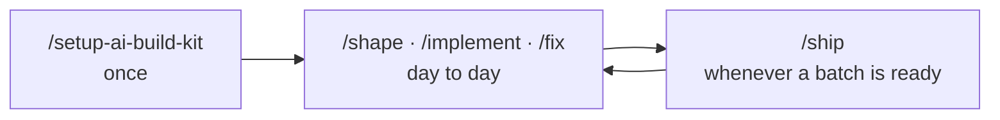

# AI Build Kit

[](LICENSE)
[](https://github.com/gwpicard/ai-build-kit/releases/latest)
[](docs/COMPATIBILITY.md)

A compact, reliable way to build software with an AI coding agent: the
discipline of a real process, without the ceremony, and without having to read
the code.

None of the nine commands asks you to open a file of code. You do need to
explain what should happen, try the results, and make the product and risk
decisions the agent cannot make for you.

## At a glance

| | |
|---|---|
| What it is | Nine commands you type into your coding agent, the process behind them, and three records that hold your project's memory. |
| Who it is for | Anyone directing an AI coding agent who wants what it builds to keep working. People who came to software from another job, and developers trying agent-led work for the first time. |
| Works with | Claude Code, which is tested. Codex is expected to work. Cursor, Gemini CLI, and any other agent that can read and edit project files, run shell commands, and use Git are experimental. [How much is proved on each](docs/COMPATIBILITY.md#how-much-has-been-proved-on-each-agent). |
| You need | A coding agent, Git, and Node for the `npx` route. |
| Install, Claude Code only | `claude plugin marketplace add gwpicard/ai-build-kit`, then `claude plugin install ai-build-kit@ai-build-kit --scope local` |
| Install, any supported agent | `npx skills add gwpicard/ai-build-kit` |
| Then type | `/ai-build-kit:setup-ai-build-kit` on the Claude plugin route, `/setup-ai-build-kit` on every other route |
| How long setup takes | One interview, answered one question at a time. You can stop and resume it. |
| Where your code lives | Your own project folder, on your own computer. |
| Licence | MIT |
| Cost | Free. You pay for the coding agent subscription. |

## Install

Choose one installation route. Do not use more than one in the same project.

For a project that uses only the Claude Code terminal app, open the project
folder and run:

```bash
claude plugin marketplace add gwpicard/ai-build-kit
claude plugin install ai-build-kit@ai-build-kit --scope local
```

Start Claude Code in that folder and type `/ai-build-kit:setup-ai-build-kit`. Local scope
keeps the plugin attached to this project on this computer without changing
the settings shared with the project.

For Codex, Cursor, Gemini CLI, another coding agent, or a project that uses
more than one agent, run this from the project folder:

```bash
npx skills add gwpicard/ai-build-kit
```

Choose the agents you use and install all fourteen AI Build Kit skills. Then ask
the agent: "Run the setup-ai-build-kit skill."

Whichever route you choose, answer one question at a time. The agent prepares
the project files, checks what the environment can do, decides the project's
build path (how careful this project has to be), creates the records, and tells you the next step.

The shared [skills installer](https://github.com/vercel-labs/skills) supports
Claude Code, Codex, Cursor, and Gemini CLI. It installs the skills inside this
project and records their source for later updates.

If this computer cannot run `npx`, download the
[latest public Release](https://github.com/gwpicard/ai-build-kit/releases/latest),
copy its `.agents/skills` folder into the project, and ask the agent: "Open
`.agents/skills/setup-ai-build-kit/SKILL.md` and run the setup-ai-build-kit skill." This manual route
keeps the same workflow, but later updates also need to be copied manually.

The nine commands are the interface. Some coding agents also list the five
background skills in a skill picker, but you never need to pick one.
[docs/COMPATIBILITY.md](docs/COMPATIBILITY.md) explains the installation paths
and fallback.

## What this is

Coding agents can write working software. They will not stop you skipping the steps that make it trustworthy: agreeing what a thing should do before building it, proving it works before saving it, checking the risky parts before anyone relies on them, and keeping records so next month you can still tell what happened.

This kit is those steps, packaged as skills the agent follows and commands you type. Nine commands, and no more: a new ability arrives inside a command that already exists, so the vocabulary you learn on day one is the vocabulary you use in month six. Three records hold the project's memory, because the agent forgets everything between sessions and the records don't. A build path, set at the start and rechecked as the project changes, decides how much of the process applies right now.

The workflow is opinionated so that you do not have to be. Whether you are an engineer makes no difference to it. What makes a difference is that the behaviour is agreed before the code, the evidence is shown before the save, and what happened gets written down. A developer can read every diff if they like. The kit never asks.

## Commands

Command names say when to use them.

| When | Type | What it does |
|---|---|---|
| I'm starting something | `/setup-ai-build-kit` | Interview, fit check, founding documents. |
| I want it to... (a new idea) | `/shape` | Turns your idea into a ready piece. |
| Build the next ready piece | `/implement` | Builds a ready piece to confirmed and saved. |
| I'm taking on several things | `/queue` | Everything ready to build, and what is waiting on what. |
| It's broken | `/fix` | Cause before code, and evidence that keeps it fixed. |
| I think it's ready | `/ship` | Checks everything, then takes it live, one path at a time. |
| I'm done for today | `/sync` | Documents caught up with reality. |
| It's been a while | `/maintain` | The service visit. |
| I'm lost | `/what-now` | Where the project stands and what to do next. |

You never choose the method and never sort your own request: each command checks what you typed against the masterplan and sends it down the right route, so picking the wrong one costs you nothing. [WORKFLOW.md](WORKFLOW.md) is the day-to-day manual for all nine.

## How a project flows


```mermaid
flowchart LR
  S["/setup-ai-build-kit<br/>once"] --> L["/shape · /implement · /fix<br/>day to day"]
  L --> P["/ship<br/>whenever a batch is ready"]
  P --> L
```

You run `/setup-ai-build-kit` once. After that you go in wherever you actually are, and none of the day-to-day commands needs another to have run first.

The first `/ship` is the heaviest, because it takes the tool live. Later ones only re-check what changed since the last one.

`/maintain` is not in the picture because it runs on its own clock rather than in this order: about monthly from the day the project is founded, whether or not it has gone live. The project tells you when one is due.

Every piece runs the same cycle: agree the behaviour in one plain sentence, choose the evidence it needs, build the smallest complete slice, try it by hand, then save it through the route the build path requires.

## Examples

A first session. You type `/setup-ai-build-kit`, and the agent interviews you one
question at a time, each question carrying its own best guess so you can correct
it rather than start from a blank page. It sets the build path, writes
`masterplan.md` and `CHANGELOG.md`, opens one issue per piece of remaining work,
and saves a checkpoint on your computer. Nothing is uploaded.

A day's work. You type `/shape` and describe what you want in your own words: "I
want people to be able to reset their own password." The kit decides whether
that is new work, a repair, or too vague to size, asks what it still needs to
know, and leaves a piece marked ready. You type `/implement`, and it builds that
one piece, shows you the evidence, and saves it.

A piece that carries a risk. The kit gives you a risk notice once: who is
exposed, what happens to them, and what would normally prevent it. You decide.
If you carry on, your acceptance is written into the masterplan with your words
and the date, and the work goes ahead.

A month later. `/maintain` tells you it is due, reads the public Release notes,
asks before updating the kit, and watches the running costs.

## Configuration

| What you can change | Where |
|---|---|
| Rules for your project that the agent must follow | `AGENTS.md` in your project |
| Keys, passwords, and tokens | `.env`, which is ignored by Git and never leaves your computer. Copy `.env.example` to start. |
| The build path, and any accepted risk | The build-path section of your `masterplan.md` |
| The commands the agent may never run | [.agents/guard/blocked-commands.md](.agents/guard/blocked-commands.md) |

Treat installed skill folders as managed packages, and update them with
`/maintain` rather than by editing them.

## The three records

Three project records hold the product's memory: `masterplan.md` is the present, your project's issues are what's left, `CHANGELOG.md` is the past. `AGENTS.md` sits alongside them, holding the standing instructions for the repository itself. The agent reads all of them so you don't have to; [WORKFLOW.md](WORKFLOW.md) explains what goes where.

## Which path will I be on?

| Situation | Likely path |
|---|---|
| Trying an idea with disposable data | Explore privately |
| Internal tool with a manual fallback | Build and run it |
| Personal data, money, sign-in by outsiders, automatic action, irreplaceable live data, or a regulated decision, in some part of it | Build with care |

The path is not a permanent label. The kit rechecks it whenever the project changes character, and none of the three is it refusing to build. On Build with care the kit builds everything outside the sensitive part the ordinary way, and in that part it names one caution before it goes live. You have it done, or you carry on and your acceptance is recorded.

## What the kit does to reduce risk

The kit is built so that nothing depends on a code review by you, so every protection is behavioural or mechanical. It opens with a fit check, which sets the build path and names each sensitive area with its caution; the three paths are explained in [fit-check.md](.agents/skills/setup-ai-build-kit/references/fit-check.md). Read [what it does not promise](#what-it-does-not-promise) alongside this section.

Every promised behaviour gets evidence. Stable rules and bugs usually get automated tests, shown failing first. Visual and exploratory work may be checked by trying it. Shared, live, or risky changes get stronger checkpoints: a pull request with a clean-machine check next to the merge button, and an independent review. The build path decides how much of this applies to a given piece of work.

Where a risk survives that, you get a risk notice: who is exposed, what happens to them, and what would normally prevent it. Then it is your call. You can carry on and have the work built, or take the flagged thing out of scope. It does not stop to ask twice. When you carry on, your acceptance is written into the build-path section with the date and your words, so making the project less careful is a decision you record rather than something the agent does on its own.

Two simpler protections sit underneath. Destructive commands are on a blocked list, alongside standing restrictions like never disabling authentication to make a test pass. Secrets live in `.env` and nowhere else.

## How it compares

| | What it is | Who it is for | How much you must learn | What it decides for you |
|---|---|---|---|---|
| All-in-one builders (Lovable, Bolt, Replit) | A hosted app builder that owns the shape of your project. | Anyone. | The platform. | Where your code lives, and how far you can take it before leaving gets hard. |
| Bare agent tools (Claude Code, Cursor, Codex) | An agent's full power, with no process around it. | Anyone. | Nothing up front, everything by experience. | Nothing. You choose when to plan, test, review and save, every time. |
| Developer skill packs (GitHub Spec Kit, Superpowers, agent-skills, Waza) | A discipline the agent applies, written by engineers for engineers. | People who read code and already have the habits. | A dozen or more skills and the order they run in. | The order of work, once you have learned it. |
| Books and guides on agentic engineering | A way of thinking about working with agents. No tooling. | Developers and tech leads. | A book. | Nothing on your machine. |
| AI Build Kit | Nine commands, three records, one build path. The least process that keeps agent-built software reliable. | People who came to software from another job, and developers trying agent-led work for the first time. | Nine command names, each named after the moment you need it. | Which route a request takes, what evidence it needs, how it is saved, and when a piece touches something sensitive enough to stop and tell you. |

Each is good at something. The builders are the fastest start. The bare agent is the most powerful. The skill packs are the strongest guarantee that an engineer's agent behaves. The kit is the shortest path from an idea to a tool that still works in six weeks, for somebody who does not want to run a process by hand.

Much of what the kit does was borrowed from people working in the open. [docs/SOURCES.md](docs/SOURCES.md) names them and says what each one contributed.

## FAQ

**Do I need to know how to code?**
No. The nine commands are the whole interface, and the kit is built so that
none of them needs you to read the code or the logs. If you can, nothing
stops you. You do have to say what should happen, try the result, and make the
product and risk decisions.

**Can a non-developer build software with an AI coding agent safely?**
Safely enough depends on what the software does. The kit opens with a fit check
that sorts your project into one of three build paths, and names each part of
it that touches something sensitive, with the one caution that has to happen
there. It never refuses to build. It tells you what you are taking on and records your decision.

**What is the alternative to Lovable or Bolt if I want to own my code?**
A coding agent working in your own project folder. That is what this kit is
built around. The code, the records, and the history stay in your project, and
you can hand the whole thing to a developer later.

**Who maintains an AI-built app after launch?**
You do, with `/maintain`. It runs about monthly from the day the project is
founded, whether or not the project has gone live. It reads the kit's public
Release notes, asks before updating anything, and watches the running costs.

**How do I stop vibe coding turning into a mess I cannot change?**
By agreeing the behaviour before the code, keeping evidence that each promise
works, and writing down what happened. Three records hold that memory across
sessions, because the agent forgets everything between them and the records
don't.

**Which coding agents does this work with?**
Claude Code is tested: the kit's scripted conversations have been run on it
and the results recorded. Codex is expected to work, but nobody has recorded a
run on it. Cursor, Gemini CLI, and any other agent that can read and edit
project files, run shell commands, and use Git are experimental. The four
named agents install through the shared skills installer, and Claude Code can
also use the plugin marketplace.
[docs/COMPATIBILITY.md](docs/COMPATIBILITY.md#how-much-has-been-proved-on-each-agent)
gives each grade and its known limits.

**Can I add it to a project I have already started?**
Yes. Setup can adopt an existing project. It understands what is already there
before anything changes, and existing files are preserved.

**Can I use my design tool?**
Yes. If you already use one, the kit records it and can use it for early screen
prototypes when your coding agent can reach it. [Pencil](https://www.pen.dev/pricing)
is currently free and may add paid features. Its [`.pen`
file](https://docs.pencil.dev/core-concepts/pen-files) can live in the project
and travel with Git, but the app has a [proprietary licence and requires
sign-in](https://www.pen.dev/eula), and warns that its [format may
change](https://docs.pencil.dev/for-developers/the-pen-format).

[Penpot](https://penpot.app/pricing/self-host) has a free cloud plan and a free
self-hosted edition; the design lives on the Penpot server you choose, not in
the project. [Sketch](https://www.sketch.com/pricing) starts at $12 per editor
per month when billed yearly, and can keep the design in a local `.sketch` file
on a Mac. The skills do not depend on any of them, so the ordinary browser
prototype remains the default.

**Does anything leave my computer?**
Not during setup. The founding save is always a local checkpoint, never a push
and never a pull request. Keys and passwords live in `.env`, which Git ignores.
Anything that would publish or share your work is explained first and needs your
approval.

**Where does the tool run once it is built?**
Wherever you host it. The kit builds and checks the tool, and it does not host
it. On the first launch, `/ship` writes a short hosting request into the
masterplan: where the code lives, which port it uses, the names of the settings
it needs, and what must survive a restart. You take that request to whoever runs
your server. A team that runs its own server on [Coolify](https://coolify.io)
can install a companion kit there, such as
[coolify-devops](https://github.com/KasperHonore/coolify-devops), which turns
that request into a running address on the team's private network or on the
internet. It is a separate install on the server, made by somebody else, and
not part of this kit.

**What does it cost?**
The kit is free. Building with it needs an agent subscription, which is the real
running cost, and accounts with services that mostly start free. `/maintain`
watches the bills once you're live.

**Is this right for my project?**
The kit is strongest for internal tools: something for your own team, holding
your own data, with nobody outside relying on it. Trackers, dashboards, small
workflow tools, internal calculators. It can also help define, prototype, and
get acceptance criteria for software other people will use.

**What happens when my project touches something sensitive?**
The fit check names the area and the one caution that goes with it: a backup
restored once, a managed service, or a person who looks before that part goes
live. The kit does the cautions it can do itself and keeps the rest of the
project moving while a person looks. Where somebody outside the team is going
to look, ask for the handover and the kit prepares it. [WORKFLOW.md](WORKFLOW.md)
lists the six areas and their cautions.

**How is this different from Spec Kit, Superpowers, or agent-skills?**
Those carry a similar discipline and are written for people who read code and
already have the habits. This kit carries the discipline for you, keeps the
vocabulary to nine commands, and says plainly when a piece touches something
sensitive and what has to happen there.

## What it does not promise

The kit is free software, provided as is, under the [MIT licence](LICENSE). There is no warranty, and the licence's own terms are the ones that apply.

The fit check and its risk notices flag what the kit can recognise. They will miss things. A risk it never named is not a risk it ruled out, and no notice should be read as a survey of everything that could go wrong with your project.

The checks verify what somebody thought to check. A green tick beside the merge button means those checks really passed, which is a smaller claim than the software being correct, safe, legal, or fit for what you plan to do with it.

The kit never refuses and never stops you: hear the notice, carry on, and it builds the thing, with your acceptance on the record. Pressure changes what you decide, not who is exposed.

You own the product and risk decisions. The kit can tell you that a second pair of eyes normally goes over who can see what; it cannot decide for you whether to go ahead, and it does not carry the consequences when you do.

It is not a substitute for a professional developer, and it is not legal, medical, financial, or security advice. Where your project touches those, the notice will say so, and acting on it is still your judgement.

## Contributing

Problems and suggestions belong in the public issue tracker. Read
[CONTRIBUTING.md](CONTRIBUTING.md) before opening one. Anything security related
is covered in [SECURITY.md](SECURITY.md).

## For technical people

You can read every diff, and the kit never asks you to. The process rests on
behavioural evidence and records rather than on a code review by you, so a
developer gets the same workflow and can look under it whenever they like.

The public repository is an Agent Skills source and a Claude Code plugin
marketplace. Each folder under `.agents/skills/` contains one skill and all of
the references, templates, or scripts it needs, and every installation route
carries the same skills. The shared installer records the source in
`skills-lock.json`. The Claude plugin keeps its copy in Claude's plugin cache,
where the nine commands use the `ai-build-kit:` prefix and the five background
skills stay out of the menu until a command needs them.

Agent Plugins is the newest route, for a client that reads that open format. The
`agent-plugin` folder holds the manifest in this repository and gains its
`skills` folder only when a numbered version is packaged, so the route is served
by the release archive rather than by cloning. Keeping that packaged copy out of
the repository is deliberate: committing it would hold the same fourteen skills
twice, and one of the two would drift. Such a client is also free to skip a skill
it judges non-standard, so the shared installer is the safer choice.

The setup-ai-build-kit skill carries the project foundation. On its first run it creates
missing project instructions, harness pointers, environment examples, and the
placeholder project check. Existing files are preserved. It then creates
`masterplan.md` and `CHANGELOG.md` from the founding interview, and opens one
issue per piece of remaining work.

Put project-specific rules in `AGENTS.md`. Treat installed skill folders as
managed packages. `maintain` reads the public Release notes, asks before an
update, and uses the same route that installed the kit. Application code,
records, project instructions, environment files, and the project's own check
remain under the project's control.

This repository is where the kit is built as well as where it is published. Each
numbered version has a matching tag and reviewed Release notes, and `/maintain`
reads the latest of those notes before it offers an update.
