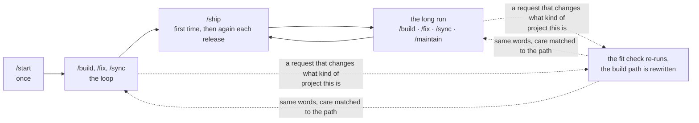

# AI Build Kit

An installable workflow that helps non-developers build reliable software with an
AI coding agent. Seven commands cover the project's life. Four internal
disciplines handle interviewing, routing, building, and review behind the
scenes.

You do not need to read code. You do need to explain what should happen, try
the results, and make the product and risk decisions the agent cannot make
for you.

## What this is

AI agents can write working software now. What they can't do is stop you from skipping the steps that make software trustworthy: agreeing what a thing should do before building it, proving it works before saving it, checking the risky parts before anyone relies on them, and keeping records so next month's you knows what this month's you did.

This kit is those steps, packaged as skills the agent follows and words you type. Seven commands cover a project's whole life, and three records hold its memory, because the agent forgets everything between sessions and the records don't. A build path, set at the start and rechecked as the project changes, decides how much of that process actually applies to this project right now. You describe what you want in plain language and judge the results by using them; the kit handles everything in between.

No coding knowledge is needed. The workflow never asks you to read code: every check is something you click or something you see.

## Start a project

Choose one installation route. Do not use both in the same project.

For a project that uses only the Claude Code terminal app, open the project
folder and run:

```bash
claude plugin marketplace add gwpicard/ai-build-kit
claude plugin install ai-build-kit@ai-build-kit --scope local
```

Start Claude Code in that folder and type `/ai-build-kit:start`. Local scope
keeps the plugin attached to this project on this computer without changing
the settings shared with the project.

For Codex, Cursor, Gemini CLI, another coding agent, or a project that uses
more than one agent, run this from the project folder:

```bash
npx skills add gwpicard/ai-build-kit
```

Choose the agents you use and install all eleven AI Build Kit skills. Then ask
the agent: "Run the start skill."

With either route, answer one question at a time. The agent prepares the
project files, checks what the environment can do, decides the project's build
path, creates the records, and tells you the next step.

The shared [skills installer](https://github.com/vercel-labs/skills) supports
Claude Code, Codex, Cursor, Gemini CLI, and many other harnesses. It installs
the skills inside this project and records their source for later updates. The
workflow itself needs an agent that can read and edit project files, run shell
commands, and use Git.

If this computer cannot run `npx`, download the
[latest public Release](https://github.com/gwpicard/ai-build-kit/releases/latest),
copy its `.agents/skills` folder into the project, and ask the agent: "Open
`.agents/skills/start/SKILL.md` and run the start skill." This manual route
keeps the same workflow, but later updates also need to be copied manually.

The seven commands are the user interface. The Claude plugin keeps the four
internal disciplines out of its command menu. Some other coding agents may
display them in a skill picker, but users never need to select them.
[docs/COMPATIBILITY.md](docs/COMPATIBILITY.md) explains the installation paths
and fallback.

## The seven words

Commands are named after moments, because that's how you'll reach for them.

| The moment | Type | What it does |
|---|---|---|
| I'm starting something | `/start` | Interview, fit check, founding documents. |
| Keep going, or: I want it to... | `/build` | The next piece, or anything new you ask for. |
| It's broken | `/fix` | Cause before code, and evidence that keeps it fixed. |
| I think it's ready | `/ship` | Checks everything, then takes it live, one path at a time. |
| I'm done for today | `/sync` | Documents caught up with reality. |
| It's been a while | `/maintain` | The service visit. |
| I'm lost | `/what-now` | Which word comes next, and why. |

You never have to choose the hidden technique. The agent decides whether the moment needs an interview, a prototype, source research, a test, a review, or outside help. You never have to sort your own request either: both `/build` and `/fix` check what you typed against the masterplan and route it correctly. [WORKFLOW.md](WORKFLOW.md) is the day-to-day manual for all seven.

## How a project flows


```mermaid
flowchart LR
  S["/start<br/>once"] --> L["/build, /fix, /sync<br/>the loop"]
  L --> P["/ship<br/>first time, then again each release"]
  P --> R["the long run<br/>/build · /fix · /sync · /maintain"]
  R --> P
  F["the fit check re-runs,<br/>the build path is rewritten"]
  L -. a request that changes what kind of<br/>project this is .-> F
  R -. a request that changes what kind of<br/>project this is .-> F
  F -. same words, care matched to the path .-> L
  F -. same words, care matched to the path .-> R
```

Every piece follows the same shape: agree the behaviour in one plain sentence, choose the evidence it needs, build the smallest complete slice, try it by hand, then save through the route the build path requires. Private exploration may end in a simple checkpoint; shared or live work lands through a pull request, so nothing reaches the shared project until you click merge, and the version your team relies on changes only when you type `/ship`.

## The three records

Three project records hold the product's memory: `masterplan.md` is the present, `plan.md` is what's left, `CHANGELOG.md` is the past. `AGENTS.md` sits alongside them as the standing instruction file the agent reads to know how this repository works. The agent reads all of them so you don't have to; [WORKFLOW.md](WORKFLOW.md) explains what goes where.

## Which path will I be on?

| Situation | Likely path |
|---|---|
| Trying an idea with disposable data | Explore privately |
| Internal tool with a manual fallback | Build and run it |
| Outside users, payments, sensitive data, or business-critical reliance | Build with expert help |
| Regulation, irreplaceable live data, high-consequence automation, or technical ownership the team cannot carry | Professional-led |

The path is not a permanent label. The kit rechecks it when the system changes character, and moving up a path means the fit check caught something before the consequences did.

## What keeps it safe

The kit assumes the person directing the work can't review code, so every protection is behavioural or mechanical. It opens with a fit check, which sets the project's build path and names any outside help that path requires. That check runs again whenever the project changes character; the four possible paths are explained in [fit-check.md](.agents/skills/start/references/fit-check.md).

Every promised behaviour gets evidence. Stable rules and bugs usually get automated tests, shown failing first. Visual and exploratory work may be checked by trying it. Shared, live, or risky changes get stronger checkpoints: a pull request with a clean-machine check next to the merge button, and an independent review. The project's build path decides how much of this applies to a given piece of work: a private prototype never gets the full production checks, and `/ship` only performs a real production launch on the path built for one.

Underneath sit the blunt protections. Destructive commands are on a blocked list, alongside standing restrictions like never disabling authentication to make a test pass. Secrets live in `.env` and nowhere else. And `/ship` reads the build path before launching, then refuses or changes shape when the project's own answers say it should.

## Does this fit my project?

The kit is strongest for internal tools: something for your own team, holding your own data, with nobody outside relying on it. Trackers, dashboards, small workflow tools, internal calculators. It can also help define, prototype, and get acceptance criteria for software other people will use; the fit check will say plainly when that production build needs expert help or professional ownership, and name the scope. Nobody should find out at launch what the fit check would have told them at the start.

## Why this and not the alternatives?

Each alternative is good at what it's for. All-in-one builders (Lovable, Bolt, Replit) are the fastest way to a working app, and the trade is that the platform owns the shape of your project, so extending it or leaving gets harder as it grows. Bare agent tools (Claude Code, Cursor, Codex on their own) give you an agent's full power with no process around it, and they'll happily help you build an unmaintainable thing quickly. The developer skill packs (Superpowers, agent-skills) are excellent, and they assume you read code, because they're written for people who do.

This kit carries the same discipline, written for people who don't read code: every check it asks of you is behaviour you can judge by using the tool. It also runs a fit check, which will tell you when your project needs a professional instead of this kit, or alongside it.

## When outside help is needed

The kit is specific about what's needed: a short advice conversation, a scoped review of one named area, a supervised change for one risky event, or professional ownership of the whole build. It prepares the brief and keeps the rest of the project moving, wherever that remains safe, while the flagged part waits.

## What it costs

The kit is free. Building with it needs an agent subscription, which is the real running cost, and accounts with services that mostly start free. `/maintain` watches the bills once you're live.

## For technical people

The public repository is an Agent Skills source and a Claude Code plugin
marketplace. Each folder under
`.agents/skills/` contains one skill and all of the references, templates, or
scripts that skill needs. Both installation routes use those same folders.
The shared installer records the source in `skills-lock.json` and places the
skills in the locations selected agents use. The Claude plugin keeps its copy
in Claude's plugin cache. Seven generated command adapters remain under the
person's control and use the `ai-build-kit:` prefix. Four hidden discipline
adapters stay available to Claude when a command needs them.

The start skill carries the project foundation. On its first run it creates
missing project instructions, harness pointers, environment examples, and the
placeholder project check. Existing files are preserved. It then creates
`masterplan.md`, `plan.md`, and `CHANGELOG.md` from the founding interview.

Put project-specific rules in `AGENTS.md`. Treat installed skill folders as
managed packages. `maintain` reads the public Release notes, asks before an
update, and uses the same route that installed the kit. Application code,
records, project instructions, environment files, and the project's own check
remain under the project's control.

This repository contains the complete public release. Each numbered version has
a matching tag and reviewed Release notes. The legacy starter files remain
temporarily so projects created before the installer model can migrate through
one compatible release.

Problems and suggestions belong in the public issue tracker. Read
[CONTRIBUTING.md](CONTRIBUTING.md) before opening one.
