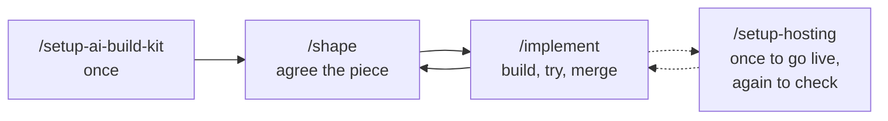

# AI Build Kit

[](LICENSE)
[](https://github.com/gwpicard/ai-build-kit/releases/latest)
[](docs/COMPATIBILITY.md)

A compact, reliable way to build software with an AI coding agent: the
discipline of a real process, without the ceremony, and without having to read
the code.

None of the six commands asks you to open a file of code. You do need to
explain what should happen, try the results, and make the product and risk
decisions the agent cannot make for you.

## At a glance

| | |
|---|---|
| What it is | Six commands you type into your coding agent, the process behind them, and three records that hold your project's memory. |
| Who it is for | Anyone directing an AI coding agent who wants what it builds to keep working. People who came to software from another job, and developers trying agent-led work for the first time. One person or a small team. |
| Works with | Claude Code, which is tested. Codex is expected to work. Cursor, Gemini CLI, and any other agent that can read and edit project files, run shell commands, and use Git are experimental. [How much is proved on each](docs/COMPATIBILITY.md#how-much-has-been-proved-on-each-agent). |
| You need | A coding agent, Git, the GitHub command-line tool installed and signed in to your GitHub account, python3, and Node for the `npx` route. A recipe needs its own command-line tools before its first launch: docker, supabase, psql and curl, plus vercel on the Vercel recipe. |
| Install, Claude Code only | `claude plugin marketplace add gwpicard/ai-build-kit`, then `claude plugin install ai-build-kit@ai-build-kit --scope local` |
| Install, any supported agent | `npx skills add gwpicard/ai-build-kit` |
| Then type | `/ai-build-kit:setup-ai-build-kit` on the Claude plugin route, `/setup-ai-build-kit` on every other route |
| How long setup takes | One interview, answered one question at a time. You can stop and resume it. |
| Where your work lives | Your code in your own project folder, and in a GitHub repository you own once you say yes. The list of work still to do lives in that repository's issues. |
| Going live | Two recipes the kit has run for real: Next.js with hosted Supabase on Vercel, or on your own server with Coolify. Any other stack still works, with fewer checks. |
| Licence | MIT |
| Cost | Free. You pay for the coding agent subscription, and for any hosting you choose. |

## Install

Choose one installation route. Do not use more than one in the same project.

For a project that uses only the Claude Code terminal app, open the project
folder and run:

```bash
claude plugin marketplace add gwpicard/ai-build-kit
claude plugin install ai-build-kit@ai-build-kit --scope local
```

Start Claude Code in that folder and type `/ai-build-kit:setup-ai-build-kit`. Local scope
keeps the plugin attached to this project on this computer without changing
the settings shared with the project.

For Codex, Cursor, Gemini CLI, another coding agent, or a project that uses
more than one agent, run this from the project folder:

```bash
npx skills add gwpicard/ai-build-kit
```

Choose the agents you use and install all eleven AI Build Kit skills. Then ask
the agent: "Run the setup-ai-build-kit skill."

Whichever route you choose, answer one question at a time. The agent prepares
the project files, checks what the environment can do, decides the project's
build path (how careful this project has to be), creates the records, and tells you the next step.

The shared [skills installer](https://github.com/vercel-labs/skills) supports
Claude Code, Codex, Cursor, and Gemini CLI. It installs the skills inside this
project and records their source for later updates.

If this computer cannot run `npx`, download the
[latest public Release](https://github.com/gwpicard/ai-build-kit/releases/latest),
copy its `.agents/skills` folder into the project, and ask the agent: "Open
`.agents/skills/setup-ai-build-kit/SKILL.md` and run the setup-ai-build-kit skill." This manual route
keeps the same workflow, but later updates also need to be copied manually.

The six commands are the interface. Some coding agents also list the five
background skills in a skill picker, but you never need to pick one.
[docs/COMPATIBILITY.md](docs/COMPATIBILITY.md) explains the installation paths
and fallback.

## What this is

Coding agents can write working software. They will not stop you skipping the
steps that make it trustworthy. Those steps are: agree what a thing should do
before building it, prove it works before saving it, check the risky parts
before anyone relies on them, and keep records so next month you can still
tell what happened.

This kit is those steps, packaged as skills the agent follows and commands you
type. There are six commands, and no more. A new ability arrives inside a
command that already exists, so the vocabulary you learn on day one is the
vocabulary you use in month six. Three records hold the project's memory,
because the agent forgets everything between sessions and the records don't.
A build path, set at the start and rechecked as the project changes, decides
how much of the process applies right now.

The workflow is opinionated so that you do not have to be. Whether you are an
engineer makes no difference to it. What makes a difference is that the
behaviour is agreed before the code, the evidence is shown before the save,
and what happened gets written down. A developer can read every diff if they
like. The kit never asks.

## Commands

Command names say when to use them.

| When | Type | What it does |
|---|---|---|
| I'm starting something | `/setup-ai-build-kit` | Interview, fit check, founding records, and the project stood up on your computer. Runs once. |
| I want something changed, new or broken | `/shape` | Turns your idea or the fault into a ready piece. A fault is reproduced first. |
| Build what's ready | `/implement` | Builds a ready piece, shows you the result, and merges it on your yes. With several ready, shows what can be built together and asks which to take. |
| I want people to use it | `/setup-hosting` | Sets up how the tool runs live, so that each merge after that goes live. Run it again to check or change that. |
| It's been a while | `/maintain` | Makes the records true again and checks the live copy against your project, plus any upkeep that is due. Also handovers and switching a tool off. |
| I'm lost | `/what-now` | Where the project stands and what to do next, including work a session left half done. |

You never choose the method and never sort your own request. Each command
checks what you typed against the masterplan and sends it down the right
route, so picking the wrong one costs you nothing. [WORKFLOW.md](WORKFLOW.md)
is the day-to-day manual for all six.

## How a project flows


```mermaid
flowchart LR
  S["/setup-ai-build-kit<br/>once"] --> SH["/shape<br/>agree the piece"]
  SH --> I["/implement<br/>build, try, merge"]
  I --> SH
  I -.-> H["/setup-hosting<br/>once to go live,<br/>again to check"]
  H -.-> I
```

You run `/setup-ai-build-kit` once. After that you go in wherever you actually
are, and none of the day-to-day commands needs another to have run first.

Day to day there are two steps. You shape a piece with `/shape`: say what you
want in your own words, and it becomes a piece with one plain line saying what
done looks like. You build it with `/implement`: it builds that one piece,
shows you the evidence, and stops so you can try it. Once the project's check
passes, it names the pull request and asks whether to merge. Not every piece
gets a pull request: on Explore privately, work is saved as a checkpoint on
your computer, and `/setup-hosting` takes nothing live.

Merging is the release. Once the tool is live, each merge you say yes to is
what puts that change in front of your users, and `/implement` reads one line
from the live copy afterwards to say whether it arrived. `/setup-hosting` is
for setting that up, and for checking it later.

`/maintain` is not in the picture because it fits anywhere. Each visit makes
the records true again and checks the live copy against your project, without
changing it. The upkeep inside
it runs on its own clock: about monthly from the day the project is founded,
whether or not it has gone live. The project tells you when that is due.

## Going live

When you found the project, the kit asks whether the team will use it in a
browser and whether it must work when your computer is off. It then names the
kind of tool you are building and shows the recipes that fit, with one
recommended. A recipe is one build stack paired with one place to run it,
which the kit has run for real and knows how to check at launch. You can
bring your own stack instead. The kit then says once what it cannot check, and
carries on.

There are two recipes today, both for a web app with sign-in and saved data.
Both build with Next.js and TypeScript, and keep the database and sign-in in a
hosted [Supabase](https://supabase.com) project.

The first runs on [Vercel](https://vercel.com). It suits a team with no
server of its own that wants the host to handle previews, going live and
rollback, and the kit runs most of its launch checks itself. Vercel's free
plan is for personal, non-commercial use, so a work team needs the paid plan.
Founding says so when the tool is for work.

The second runs on your own server with [Coolify](https://coolify.io). It
suits a team that already runs Coolify, or wants the app on a server it rents.
The kit never contacts that server. On the first launch it writes a short
hosting request: the repository, the port, the names of the settings the tool
needs, what must survive a restart, and the path that shows the tool is
healthy. You take it to whoever runs the server, and paste their answers
back. The checks that need the server run there, and the kit reads the
results you paste.

A companion such as
[coolify-devops](https://github.com/KasperHonore/coolify-devops) can turn that
request into a running address, on the team's private network or on the
internet. It is an agent skill that runs in a coding session in the team's
deployment repository and talks to Coolify through its API. It is a separate
install, made by somebody else, and not part of this kit.

Type `/setup-hosting` when you want people to use the tool. On a recipe it
works through the recipe's checks in order and gives you one plain line for
each: preview up, live address updated, rollback possible, backup present,
restore works, no secret in the repo, logs readable, health answers. A check
that fails or cannot run is a warning. You hear it once, it goes in the
changelog, and the launch goes ahead. The one thing a first launch waits for is
the live address.

During a launch you asked for, the commands the recipe names
run without a second yes.

Some of those checks reach your data. The restore check copies the live
database onto this computer, and stops the local database while it runs. On a
free database plan, which keeps no backups of its own, the kit takes a backup
after each launch into a dated folder outside the repository.

Each pull request gets its own preview. Previews use a second database project
kept for them, never the live one. Where the plan has no room for a second
project, the Coolify recipe points previews at the live data instead, and says
so once.

After that, each merge deploys. The host builds your main copy every time a
change merges into it, so `/implement` checks the live side before it asks.
A change that adds to the database waits until `/setup-hosting` has applied
that addition, which only ever adds, so the version live now keeps working. A
change that needs a new secret waits until the host has it. Run
`/setup-hosting` again whenever you want the live copy compared with your
project, or moved to another host or recipe.

Rollback is checked, not tried. The launch confirms that an earlier build is
still there to go back to, and says "rollback possible, not tried". If the
live tool breaks just after a change goes live, the kit offers the earlier
version back first, names it, and rolls back only on your yes. A rollback does
not undo a database change, which is why database changes only add.

On Vercel the kit runs the rollback itself. After it, new merges stay off the
live copy until the repair is promoted, on your yes, and the kit says so at
the time. On Vercel's free plan only the build just before can be brought
back. On Coolify you click the rollback on Coolify's own page, since neither
the kit nor the companion's tools can make it, and the kit reads the result
back.

Both recipes were run for real on a throwaway app before the kit offered
them. On each one the preview, launch, rollback, secrets, logs and health
steps worked on a live deployment. The backup and restore steps are shared by
both recipes and were run for real once. Coolify was run on a private network
and on the public internet.

Two limits came out of those runs. On Coolify, a preview for an app with no
domain runs on the server but has no address you can open, and the kit says
so. And no run has yet proved that previews stay off the live database, since
each run shared one database between previews and the live copy.

Any other stack or host still works. `/setup-hosting` then checks a general
list instead, such as a backup, a restore rehearsal, a manual fallback and a
way to roll back. Anything missing is a warning, said once. Where somebody else runs the
server, the kit writes the same hosting request. It cannot roll back for you
off a recipe, and says what a rollback there would need.

## Working as a team

Several people can work on one project. Each of you is a collaborator on the
GitHub repository and keeps your own keys in your own `.env`. The list of work
lives in the repository's issues, so there is no shared file to clash over.
Taking a piece puts your name on it, and `/implement` skips a piece somebody
else has taken. If another open piece would be built in the same place, `/shape`
tells you before the work starts.

On a shared project, each piece is built on its own branch, from an
up-to-date copy of the main branch, and arrives as a pull request. A person
decides each merge. Before asking for yours, `/implement` checks whether GitHub
can merge the pull request. When another change has landed in the same place,
it says so and offers to settle the merge conflict the ordinary GitHub way:
merge the newest main copy into the branch and push it again, never with a
force push. It runs the check again before it asks.

Once a merge is under way on your computer, `/what-now` explains which two
changes collided. A conflict is settled by the kit only when the records make
the right outcome clear. Otherwise both sides are kept and you are asked. A
conflict that touches data or deployment is never guessed through.

The kit works for one person or a small team. It is not optimised for large
teams, or for many agents building in parallel. Each agent session builds one
piece at a time.

## Examples

A first session. You type `/setup-ai-build-kit`, and the agent interviews you
one question at a time, each question carrying its own best guess so you can
correct it rather than start from a blank page. It sets the build path, writes
`masterplan.md` and `CHANGELOG.md`, says which GitHub repository it will use
and whether that is public, and opens one issue there for each piece of work
still to do. It saves a checkpoint on your computer. None of your code
is uploaded: the first piece that needs to put it online asks you first.

A day's work. You type `/shape` and describe what you want in your own words:
"I want people to be able to reset their own password." The kit decides
whether that is new work, a repair, or too vague to size, asks what it still
needs to know, and leaves a piece marked ready. You type `/implement`, and it
builds that one piece, shows you the evidence, and saves it. Once the check is
green it names the pull request and asks whether to merge.

A piece that carries a risk. The kit gives you a risk notice once: who is
exposed, what happens to them, and what would normally prevent it. You decide.
If you carry on, your acceptance is written into the masterplan with your words
and the date, and the work goes ahead.

A month later. `/maintain` tells you it is due, reads the public Release notes,
and asks before updating the kit. Once the tool is live it compares the live
copy with your project and reads the bills and the error alerts.

## Configuration

| What you can change | Where |
|---|---|
| Rules for your project that the agent must follow | `AGENTS.md` in your project |
| Keys, passwords, and tokens | Never in a file Git tracks. On this computer they live in files Git ignores, such as `.env`; copy `.env.example` to start. The live values sit in your host's own settings. |
| The build path, and any accepted risk | The build-path section of your `masterplan.md` |
| The recipe your project runs on | The `Recipe:` line in the stack section of your `AGENTS.md` |
| The commands the agent may never run | [.agents/guard/blocked-commands.md](.agents/guard/blocked-commands.md) |

Treat installed skill folders as managed packages, and update them with
`/maintain` rather than by editing them.

## The three records

Three project records hold the product's memory: `masterplan.md` is the
present, your project's issues are what's left, `CHANGELOG.md` is the past.
`AGENTS.md` sits alongside them, holding the standing instructions for the
repository itself. The agent reads all of them so you don't have to;
[WORKFLOW.md](WORKFLOW.md) explains what goes where.

## Which path will I be on?

| Situation | Likely path |
|---|---|
| Trying an idea with disposable data | Explore privately |
| Internal tool with a manual fallback | Build and run it |
| Personal data, money, sign-in by outsiders, automatic action, irreplaceable live data, or a regulated decision, in some part of it | Build with care |

The path is not a permanent label. The kit rechecks it whenever the project
changes character, and none of the three is it refusing to build. On Build
with care the kit builds everything outside the sensitive part the ordinary
way, and in that part it names one caution before it goes live. You have it
done, or you carry on and your acceptance is recorded.

## What the kit does to reduce risk

The kit is built so that nothing depends on a code review by you, so every
protection is behavioural or mechanical. It opens with a fit check, which sets
the build path and names each sensitive area with its caution; the three paths
are explained in [fit-check.md](.agents/skills/setup-ai-build-kit/references/fit-check.md).
Read [what it does not promise](#what-it-does-not-promise) alongside this
section.

Every promised behaviour gets evidence. Stable rules and bugs usually get
automated tests, shown failing first. Visual and exploratory work may be
checked by trying it. Shared, live, or risky changes get stronger checkpoints:
a pull request with a clean-machine check next to the merge button, and an
independent review. The build path decides how much of this applies to a given
piece of work.

Where a risk survives that, you get a risk notice: who is exposed, what
happens to them, and what would normally prevent it. Then it is your call. You
can have it done first, carry on and have the work built, or take the flagged
thing out of scope. It does not stop to ask twice. When you carry on, your
acceptance is written into the build-path section with the date and your
words. Making the project less careful is a decision you record, and the agent
never makes it on its own.

Some actions always wait for you. Your code goes online for the first time
only after you say yes, with the repository named and whether it is public or
private. A merge happens only on a yes that names it, and in Claude Code a
confirmation box asks you to allow it. A command that changes a live service's
settings or data names everything it will change and waits for your yes.

During a launch you asked for, the commands the recipe names are that launch,
and need no second yes. The
kit never uses a login another tool keeps for itself, such as one stored in
your computer's keychain.

Some commands are switched off. In Claude Code, the settings founding gives
your project refuse a direct push to the main branch, a force push and a
forced delete. A project that already had its own Claude Code settings keeps
them, and the first monthly visit offers the missing push and merge rules.
Other agents get the same rules in writing, in a blocked list that also holds
standing restrictions like never disabling authentication to make a test pass.
Secrets never go in a file Git tracks.

## How it compares

| | What it is | Who it is for | How much you must learn | What it decides for you |
|---|---|---|---|---|
| All-in-one builders (Lovable, Bolt, Replit) | A hosted app builder that owns the shape of your project. | Anyone. | The platform. | Where your code lives, and how far you can take it before leaving gets hard. |
| Bare agent tools (Claude Code, Cursor, Codex) | An agent's full power, with no process around it. | Anyone. | Nothing up front, everything by experience. | Nothing. You choose when to plan, test, review and save, every time. |
| Developer skill packs (GitHub Spec Kit, Superpowers, agent-skills, Waza) | A discipline the agent applies, written by engineers for engineers. | People who read code and already have the habits. | A dozen or more skills and the order they run in. | The order of work, once you have learned it. |
| Books and guides on agentic engineering | A way of thinking about working with agents. No tooling. | Developers and tech leads. | A book. | Nothing on your machine. |
| AI Build Kit | Six commands, three records, one build path. The least process that keeps agent-built software reliable. | People who came to software from another job, and developers trying agent-led work for the first time. | Six command names, each named after the moment you need it. | Which route a request takes, what evidence it needs, how it is saved, and when a piece touches something sensitive enough to stop and tell you. |

Each is good at something. The builders are the fastest start. The bare agent
is the most powerful. The skill packs are the strongest guarantee that an
engineer's agent behaves. The kit is the shortest path from an idea to a tool
that still works in six weeks, for somebody who does not want to run a process
by hand.

Much of what the kit does was borrowed from people working in the open.
[docs/SOURCES.md](docs/SOURCES.md) names them and says what each one
contributed.

## FAQ

**Do I need to know how to code?**
No. The six commands are the whole interface, and the kit is built so that
none of them needs you to read the code or the logs. If you can, nothing
stops you. You do have to say what should happen, try the result, and make the
product and risk decisions.

**Can a non-developer build software with an AI coding agent safely?**
Safely enough depends on what the software does. The kit opens with a fit check
that sorts your project into one of three build paths, and names each part of
it that touches something sensitive, with the one caution that has to happen
there. It never refuses to build. It tells you what you are taking on and records your decision.

**What is the alternative to Lovable or Bolt if I want to own my code?**
A coding agent working in your own project folder. That is what this kit is
built around. The code, the records, and the history stay in your project, and
you can hand the whole thing to a developer later.

**Can several people work on the same project?**
Yes. Each piece goes through its own pull request, and a merge conflict is
resolved the ordinary GitHub way. The kit is built for one person or a small
team, and is not optimised for large teams.
[Working as a team](#working-as-a-team) says how it works.

**Who maintains an AI-built app after launch?**
You do, with `/maintain`. It runs about monthly from the day the project is
founded, whether or not the project has gone live. It reads the kit's public
Release notes, asks before updating anything, and once the tool is live it
reads the bills and the error alerts.

**How do I stop vibe coding turning into a mess I cannot change?**
By agreeing the behaviour before the code, keeping evidence that each promise
works, and writing down what happened. Three records hold that memory across
sessions, because the agent forgets everything between them and the records
don't.

**Which coding agents does this work with?**
Claude Code is tested: the kit's scripted conversations have been run on it
and the results recorded. Codex is expected to work, but nobody has recorded a
run on it. Cursor, Gemini CLI, and any other agent that can read and edit
project files, run shell commands, and use Git are experimental. The four
named agents install through the shared skills installer, and Claude Code can
also use the plugin marketplace.
[docs/COMPATIBILITY.md](docs/COMPATIBILITY.md#how-much-has-been-proved-on-each-agent)
gives each grade and its known limits.

**Can I add it to a project I have already started?**
Yes. Setup can adopt an existing project. It understands what is already there
before anything changes, and existing files are preserved.

**Can I use my design tool?**
Yes. If you already use one, the kit records it and can use it for early screen
prototypes when your coding agent can reach it. [Pencil](https://www.pen.dev/pricing)
is currently free and may add paid features. Its [`.pen`
file](https://docs.pencil.dev/core-concepts/pen-files) can live in the project
and travel with Git, but the app has a [proprietary licence and requires
sign-in](https://www.pen.dev/eula), and warns that its [format may
change](https://docs.pencil.dev/for-developers/the-pen-format).

[Penpot](https://penpot.app/pricing/self-host) has a free cloud plan and a free
self-hosted edition; the design lives on the Penpot server you choose, not in
the project. [Sketch](https://www.sketch.com/pricing) can keep the design in a
local `.sketch` file on a Mac. The skills do not depend on any of them, so the ordinary browser
prototype remains the default.

**Does anything leave my computer?**
Some things do. Founding opens your project's
pieces of work as issues in a GitHub repository you own, which can be private.
Before it does, it names the repository and says whether it is public; on a
public one it offers to stop so you can choose a private one.

It also replaces
GitHub's default labels and switches on removing a branch once it merges.
Your code stays on your computer until the first piece that needs to upload it
asks you, naming the repository and whether it is public or private.

Founding
itself saves only a local checkpoint. Keys and passwords live in `.env`, which
Git ignores. A merge, and any change to a live service, waits for your yes.

**Where does the tool run once it is built?**
Wherever you host it. The kit builds and checks the tool, and it does not host
it. On one of the two recipes it knows how to check the launch, the rollback
and the backup there; on any other stack it gives you a general list.
[Going live](#going-live) says what each recipe covers.

**What does it cost?**
The kit is free. Building with it needs an agent subscription, which is the
real running cost, and accounts with services that mostly start free. A free
plan may not cover a work team, and founding says so when a recipe's terms
apply. `/maintain` reads the bills once you're live.

**Is this right for my project?**
The kit is strongest for internal tools: something for your own team, holding
your own data, with nobody outside relying on it. Trackers, dashboards, small
workflow tools, internal calculators. It can also help define, prototype, and
get acceptance criteria for software other people will use.

**What happens when my project touches something sensitive?**
The fit check names the area and the one caution that goes with it: a backup
restored once, a managed service, or a person who looks before that part goes
live. The kit does the cautions it can do itself and keeps the rest of the
project moving while a person looks. Where somebody outside the team is going
to look, ask `/maintain` for the handover and the kit prepares it.
[WORKFLOW.md](WORKFLOW.md) lists the six areas and their cautions.

**How is this different from Spec Kit, Superpowers, or agent-skills?**
Those carry a similar discipline and are written for people who read code and
already have the habits. This kit carries the discipline for you, keeps the
vocabulary to six commands, and says plainly when a piece touches something
sensitive and what has to happen there.

## What it does not promise

The kit is free software, provided as is, under the [MIT licence](LICENSE).
There is no warranty, and the licence's own terms are the ones that apply.

The fit check and its risk notices flag what the kit can recognise. They will
miss things. A risk it never named is not a risk it ruled out, and no notice
should be read as a survey of everything that could go wrong with your
project.

The checks verify what somebody thought to check. A green tick beside the
merge button means those checks really passed, which is a smaller claim than
the software being correct, safe, legal, or fit for what you plan to do with
it. A recipe's launch lines say what was checked on the day, and a rollback
that is possible was not tried.

The kit never refuses, and where you are there to decide it does not stop you:
hear the notice, carry on, and it builds the thing, with your acceptance on
the record. A run left going on its own stops at a sensitive area and hands it
back to you, because nobody is there to carry on. It never merges or uploads
on its own either. Pressure changes what you decide, not who is exposed.

You own the product and risk decisions. The kit can tell you that a second
pair of eyes normally goes over who can see what; it cannot decide for you
whether to go ahead, and it does not carry the consequences when you do.

It is not a substitute for a professional developer, and it is not legal,
medical, financial, or security advice. Where your project touches those, the
notice will say so, and acting on it is still your judgement.

## Contributing

Problems and suggestions belong in the public issue tracker. Read
[CONTRIBUTING.md](CONTRIBUTING.md) before opening one. Anything security related
is covered in [SECURITY.md](SECURITY.md).

## For technical people

You can read every diff, and the kit never asks you to. The process rests on
behavioural evidence and records rather than on a code review by you, so a
developer gets the same workflow and can look under it whenever they like.

The public repository is an Agent Skills source and a Claude Code plugin
marketplace. Each folder under `.agents/skills/` contains one skill and all of
the references, templates, or scripts it needs, and every installation route
carries the same skills. The shared installer records the source in
`skills-lock.json`. The Claude plugin keeps its copy in Claude's plugin cache,
where the six commands use the `ai-build-kit:` prefix and the five background
skills stay out of the menu until a command needs them.

Agent Plugins is the newest route, for a client that reads that open format.
The `agent-plugin` folder holds the manifest in this repository and gains its
`skills` folder only when a numbered version is packaged, so the route is
served by the release archive rather than by cloning. Keeping that packaged
copy out of the repository is deliberate: committing it would hold the same
eleven skills twice, and one of the two would drift. Such a client is also
free to skip a skill it judges non-standard, so the shared installer is the
safer choice.

The setup-ai-build-kit skill carries the project foundation. On its first run
it creates missing project instructions, harness pointers, environment
examples, the small helper that prints the list of pieces, the Claude Code
settings that hold the push and merge rules, and the placeholder project
check. Existing files are preserved. It then creates `masterplan.md` and
`CHANGELOG.md` from the founding interview, and opens one issue per piece of
remaining work.

The recipes live in the setup-hosting skill's `recipes/` folder, one file for
each stack and host. Each one says, for every launch step, what happens, what
a pass looks like and who runs the check, and ends with the record of the real
run that proved it. A recipe joins the menu only after that run.

Put project-specific rules in `AGENTS.md`. Treat installed skill folders as
managed packages. `maintain` reads the public Release notes, asks before an
update, and uses the same route that installed the kit. Application code,
records, project instructions, environment files, and the project's own check
remain under the project's control.

This repository is where the kit is built as well as where it is published.
Each numbered version has a matching tag and reviewed Release notes, and
`/maintain` reads the latest of those notes before it offers an update.
