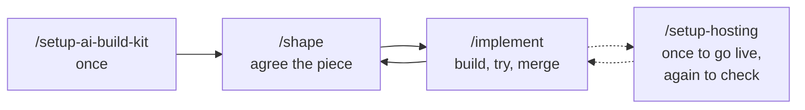

# AI Build Kit

[](LICENSE)
[](https://github.com/gwpicard/ai-build-kit/releases/latest)

AI Build Kit helps people without a software background and small teams plan,
build and run tools with Claude Code, Codex, Cursor, Gemini CLI or GitHub Copilot.
You explain what should happen and try the result; the kit directs the agent's
work without requiring you to read code.

It installs eleven skills: six commands you type and five background skills
that the commands call. Claude Code is tested, Codex is expected to work, and
the others are experimental. Read the [agent grades and known
limits](docs/COMPATIBILITY.md#how-much-has-been-proved-on-each-agent) before choosing.

## What you get

A piece is one task with a result you can check. The commands take it from an
idea to a saved change.

| When | Type | What it does |
|---|---|---|
| I'm starting something | `/setup-ai-build-kit` | Interviews you, checks the project's risks and prepares it on your computer. Runs once. |
| I want something changed, new or broken | `/shape` | Turns your idea or the fault into a ready piece. Reproduces a fault first. |
| Build what's ready | `/implement` | Builds a ready piece, shows the result and merges it on your yes. With several ready, shows what can be built together and asks which to take. |
| I want people to use it | `/setup-hosting` | Sets up how the tool runs live, so each later merge goes live. Run it again to check or change that. |
| It's been a while | `/maintain` | Makes the records true again, reads the live copy and reports gaps, plus any upkeep that is due. Also prepares handovers and switches a tool off. |
| I'm lost | `/what-now` | Says where the project stands and what to do next, including work a session left half done. |

The masterplan (`masterplan.md`) describes what your tool does now. Your
project's GitHub issues hold the work still to do. `CHANGELOG.md` records what
happened. The agent reads these records when a new session starts.

## Quick start

You need a coding agent, Git, Python 3 and the GitHub command-line tool (`gh`),
installed and signed in. The shared installer also needs Node.js for `npx`.
Setup reports any extra tools your chosen launch needs.

Choose one route per project. For the Claude Code terminal app alone, run
these commands from your project folder:

```bash
claude plugin marketplace add gwpicard/ai-build-kit
claude plugin install ai-build-kit@ai-build-kit --scope local
```

Start Claude Code there and type `/ai-build-kit:setup-ai-build-kit`. Local scope
attaches the plugin to this project on this computer.

For another agent, or a project using several agents, run:

```bash
npx skills add gwpicard/ai-build-kit
```

Choose the agents you use and install all eleven skills. Then ask your agent:
"Run the setup-ai-build-kit skill."

Setup interviews you one question at a time, with a best guess you can correct.
You can stop and resume it. It prepares the project and tells you what to do
next. [Manual installation](docs/COMPATIBILITY.md#manual-fallback) and the
[Agent Plugins route](docs/COMPATIBILITY.md#choose-one-installation-route)
are also available.

## A sample session

This shortened example comes from a replayed session on an office noticeboard
app, using Claude Code. The tool is already live and a change is ready to merge.

> **Person:** `/implement` I opened the preview and the sign-in button says
> "Email me a sign-in link", which is right. Merge it and put it live.
>
> **Agent:** All four tests and the project check pass. I've added a dated
> changelog line. The confirmation box will ask you to allow the merge.

After the person allows the merge, the agent merges and reads the live page:

> **Agent:** The sign-in button at the live address now says "Email me a
> sign-in link". The live copy runs this change. This read only checks the button text.
>
> **Person:** Priya still sees the old "Continue" button. Can you put it out again?
>
> **Agent:** The live page already shows the new button. Try a full refresh
> in Priya's browser. I have not deployed it again.

## How it works


```mermaid
flowchart LR
  S["/setup-ai-build-kit<br/>once"] --> SH["/shape<br/>agree the piece"]
  SH --> I["/implement<br/>build, try, merge"]
  I --> SH
  I -.-> H["/setup-hosting<br/>once to go live,<br/>again to check"]
  H -.-> I
```

You agree what the piece should do before the agent builds it. The agent
chooses how to prove it works, then stops so you can try it. If you pick the
wrong command, the kit routes your request to the right one.

A checkpoint is a saved snapshot of your work. Private exploration can keep
it on your computer. Shared or live changes arrive as a pull request, a
proposed change on GitHub that you decide whether to merge into the main copy.
Once the tool is live, that merge puts the change in front of your users.

`/what-now` and `/maintain` fit anywhere, so they are outside the diagram.
[WORKFLOW.md](WORKFLOW.md) explains the daily work, including
[team work](WORKFLOW.md#11-working-as-a-team) and
[configuration](WORKFLOW.md#configuration). For packaging and agent settings,
read [Compatibility](docs/COMPATIBILITY.md#what-is-installed).

## Going live

A recipe pairs the tools used to build an app with a place to run it. The kit
has run these two recipes for real; both use Next.js, TypeScript and hosted
Supabase for data and sign-in:

- [On Vercel](.agents/skills/setup-hosting/recipes/nextjs-supabase-on-vercel.md), for a team without its own server. The kit runs most launch checks itself.
- [On your server with Coolify](.agents/skills/setup-hosting/recipes/nextjs-supabase-on-coolify.md), for a team that runs or rents a server. Whoever runs it performs the server checks and sends back the results.

Check each recipe's plan terms before choosing. Any other stack or host works
with fewer checks and a general launch checklist.
[Going live in WORKFLOW.md](WORKFLOW.md#9-going-live) covers previews, backups
and rollback, which means returning to an earlier live version.

## Keeping it safe

Setup chooses a build path, which decides how much checking your project
needs. The kit rechecks it as the project changes.

| Situation | Likely path |
|---|---|
| Trying an idea with disposable data | Explore privately |
| Internal tool with a manual fallback | Build and run it |
| Personal data, money, outside sign-in, automatic action, irreplaceable data or a regulated decision | Build with care |

The agent must show evidence for what it says works. Shared, live or risky
changes get checks on a clean machine and an independent review before
merging. A sensitive area may need another person to review it; the agent
cannot replace that person with its own review. [Evidence and saving rules](WORKFLOW.md#6-evidence) explain
what applies to each change.

You hear who a risk affects and what would normally prevent it. You can have
that caution done, remove the work or carry on with your acceptance recorded.
The kit builds when you are there to decide. A run left on its own stops at a
sensitive area and hands it back to you. [Risk notices](WORKFLOW.md#8-sensitive-areas-and-the-risk-notice)
explain the decision.

Setup opens one GitHub issue for each piece in a repository you own, which can
be private. It names the repository and says whether it is public. On a public
repository it warns that the plan will be public and carries on unless you
ask it to stop. Setup saves a local checkpoint. Your code stays on your
computer until the first piece that needs to upload it asks you, naming the
repository and whether it is public or private.

Every merge waits for your yes. Changes to live settings or data need a yes
that names them; a launch request authorises the commands its recipe names.
Secrets stay out of files Git tracks. Claude Code's project settings block
direct pushes to the main branch, force pushes and forced deletes. Existing
settings are preserved, and `/maintain` offers missing rules. Other agents
receive written restrictions; [their approval settings need your
attention](docs/COMPATIBILITY.md#optional-harness-features).

## How it compares

These are different ways to organise the work. Features vary within each category.

| | Hosted app builders, such as [Lovable](https://docs.lovable.dev/introduction/welcome) | Coding agent on its own | Developer toolkits, such as [Spec Kit](https://github.com/github/spec-kit) | AI Build Kit |
|---|---|---|---|---|
| Best for | A fast first app | Control over how you work | Defining a development process | Small teams wanting the agent to run the process |
| Where you work | Platform workspace; code export varies | Your project folder | Your project folder | Your folder and GitHub repository |
| Reading code | Natural-language building | You judge the work | Your team decides | Not required |
| Process | Platform's workflow | You choose it | Toolkit's planning and build steps | Plan, build, check, go live, maintain |
| What you learn | Platform controls | Agent and development tools | Toolkit commands and conventions | Six commands and how to try the result |
| Going live | Platform publishing | You arrange it | Depends on the toolkit | Two recipes or a general checklist |

The kit adds steps. If you need a quick throwaway demo, a hosted builder is faster.

## Limits

The kit suits internal tools with a manual fallback. For software outsiders
rely on, it can help you plan and prototype, but it cannot establish that the
result is safe. It does not suit large teams or many agents building at once.

Risk notices will miss things. Passing checks cover only what somebody thought
to check; they do not establish that software is correct, safe, legal or fit
for your purpose. Launch records say what was checked that day. The kit
confirms whether an earlier build exists without trying a rollback.

You own the product and risk decisions. The kit cannot replace a professional
developer or provide legal, medical, financial or security advice.

## Short FAQ

**Do I need to know how to code?**
No. You do need to explain the result you want, try what was built and decide
which risks to accept. A developer can read every change if they wish.

**Can I add it to an existing project?**
Yes. Setup reads what is already there and preserves existing files.

**Who maintains the tool after launch?**
You do, with `/maintain`. Each visit checks the records and reads the live copy
without changing it. Upkeep is due about monthly from setup, including kit
updates and, once live, the bills and error alerts. Updates wait for your yes.

**Where does the tool run once it is built?**
Wherever you host it; the kit does not host it. For Coolify, a companion such
as [coolify-devops](https://github.com/KasperHonore/coolify-devops) can use the
hosting request. It is a separate install, made by somebody else.

**Can I use my design tool?**
Yes, for early screens when your agent can reach it; browser prototypes remain
the default. [Pencil](https://www.pen.dev/pricing) is currently free, with paid features planned. Pencil is [proprietary and requires sign-in](https://www.pen.dev/eula); its [format may change](https://docs.pencil.dev/for-developers/the-pen-format). Pencil's [`.pen` files](https://docs.pencil.dev/core-concepts/pen-files) can live in your project. [Penpot](https://penpot.app/pricing/self-host) has a free edition with designs on a server. [Sketch](https://www.sketch.com/docs/getting-started/saving-and-managing-documents/) can save local files on a Mac.

**What does it cost?**
The kit is free. Your coding agent subscription and hosting have their own
prices. Check the recipe's terms for work use.

## Contributing, security and licence

Read [CONTRIBUTING.md](CONTRIBUTING.md) for problems and suggestions, and
[SECURITY.md](SECURITY.md) for security reports. The kit is provided as is,
without warranty, under the [MIT licence](LICENSE).
